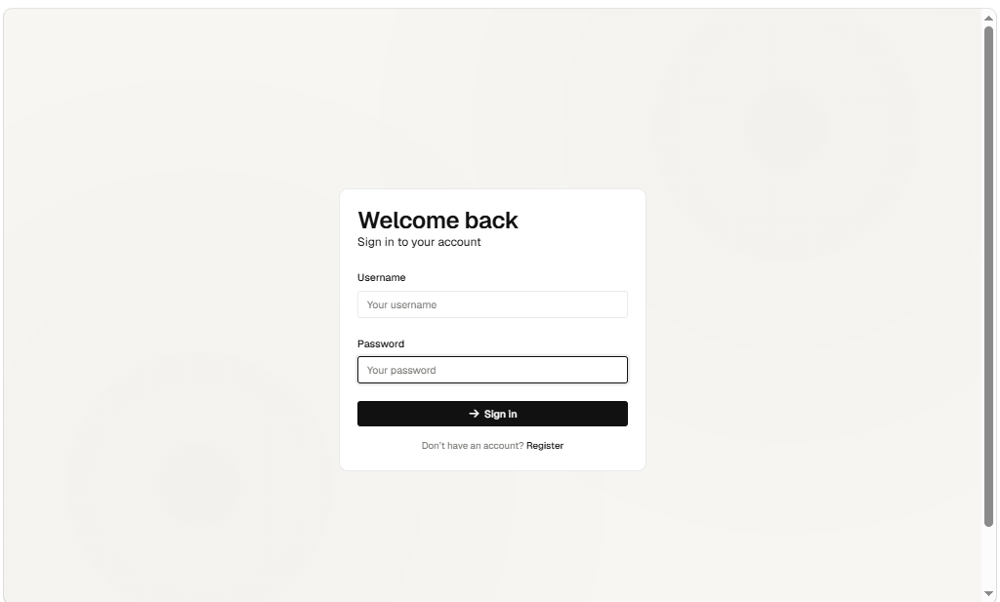
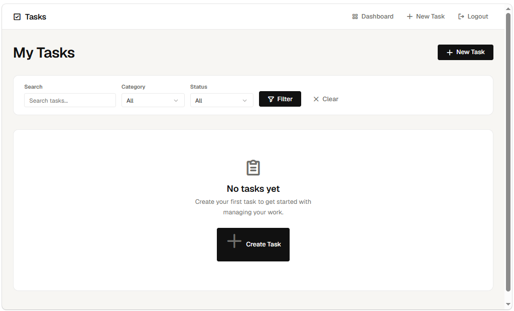

# 📋 Task Management System


A full-stack **Task Management System** built using **Flask**, **SQLite**, **SQLAlchemy**, and **Flask-Login**. The application provides secure user authentication, task creation, editing, deletion, filtering, and a clean responsive dashboard for efficient task management.
---
## ✨ Features

- 🔐 Secure User Registration and Login
- 👤 User Authentication using Flask-Login
- ➕ Create New Tasks
- ✏️ Edit Existing Tasks
- 🗑️ Delete Tasks
- ✅ Mark Tasks as Completed
- 🔍 Search Tasks
- 🏷️ Filter Tasks by Category
- 📅 Due Date Management
- ⚡ Responsive Dashboard
- 💾 SQLite Database Integration
- 🧩 SQLAlchemy ORM
- 🛡️ Input Validation and Error Handling
- 🧪 Unit Testing using PyTest
---
# 📸 Application Screenshots

## 🔐 Login Page



## 📝 Register Page


## 📋 Dashboard



## ➕ Create Task


---
# 🛠️ Tech Stack

| Category | Technologies |
|----------|--------------|
| Backend | Flask, Python |
| Database | SQLite, SQLAlchemy |
| Authentication | Flask-Login |
| Frontend | HTML5, CSS3, JavaScript |
| Testing | PyTest |
| Version Control | Git, GitHub |

---
# 📂 Project Structure

```text
task-management-system/
│
├── models/               # Database models
├── routes/               # Application routes
├── static/               # CSS, JavaScript, Images
├── templates/            # HTML templates
├── tests/                # Unit tests
├── utils/                # Helper functions
├── screenshots/          # Application screenshots
│
├── app.py                # Main application entry point
├── config.py             # Application configuration
├── extensions.py         # Flask extensions
├── requirements.txt      # Project dependencies
├── README.md             # Project documentation
└── .gitignore
```
---
# ⚙️ Installation

## 1. Clone the Repository

```bash
git clone https://github.com/Mahendrakarthikeyan/task-management-system.git
```

## 2. Navigate to the Project

```bash
cd task-management-system
```

## 3. Create a Virtual Environment

### macOS / Linux

```bash
python3 -m venv venv
source venv/bin/activate
```

### Windows

```cmd
python -m venv venv
venv\Scripts\activate
```

## 4. Install Dependencies

```bash
pip install -r requirements.txt
```
---

# ▶️ Running the Application

Start the Flask development server:

```bash
python app.py
```

or on macOS/Linux:

```bash
python3 app.py
```

Open your browser and visit:

```
http://127.0.0.1:5000
```

Register a new account and start managing your tasks.
---

# ▶️ Running the Application

Start the Flask development server:

```bash
python app.py
```

or on macOS/Linux:

```bash
python3 app.py
```

Open your browser and visit:

```
http://127.0.0.1:5000
```

Register a new account and start managing your tasks.
---

# 🧪 Running Tests

Run the automated test suite using:

```bash
pytest
```

or

```bash
pytest -v
```

The project includes unit tests covering authentication and task management functionality.
---

# 🚀 Future Enhancements

- 📧 Email notifications for upcoming tasks
- 🌙 Dark mode support
- 📅 Calendar integration
- 📱 Mobile-friendly improvements
- 📂 File attachments for tasks
- 🔔 Push notifications
- 🌐 REST API support
- 🐳 Docker containerization
---

# 👨‍💻 Author

**Mahendra Karthikeyan**

- GitHub: https://github.com/Mahendrakarthikeyan

If you found this project useful, consider giving it a ⭐ on GitHub.
